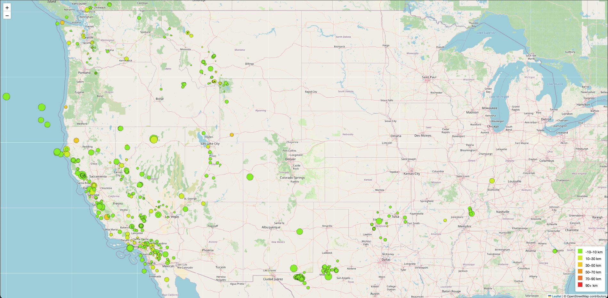
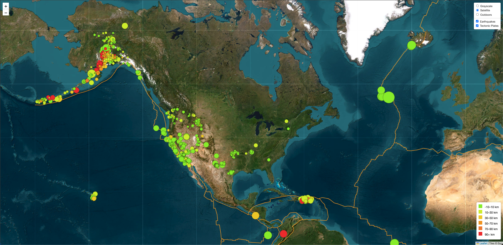

# **Leaflet Challenge: Earthquake Visualization Project**

Created by Matthew Guy, 2025

An interactive map-based data visualization project using **Leaflet.js, D3.js, and JavaScript**. This project pulls in real-time global earthquake data and plots it on a map with interactive markers that reflect both the **magnitude and depth** of each event. An optional advanced layer overlays tectonic plate boundaries and multiple base map views.

---

## **Table of Contents**
- [Features](#features)
- [Installation](#installation)
- [Usage Instructions](#usage-instructions)
- [Dataset Details](#dataset-details)
- [Map Functionality](#map-functionality)
- [Map Preview](#map-preview)
- [Deployment](#deployment)
- [Future Enhancements](#future-enhancements)
- [About](#about)
- [Resources](#resources)

---

## **Features**

**Earthquake Data Layer**: All earthquakes from the past 7 days are plotted using circle markers.  
**Magnitude Scaling**: Marker size is proportional to the earthquake's magnitude.  
**Depth Coloring**: Marker color reflects the earthquake's depth beneath the earth’s surface.  
**Interactive Popups**: Clickable markers display magnitude, location, and depth.  
**Legend**: Color scale legend for depth values.  
**Tectonic Plate Overlay (Part 2)**: Adds boundary lines for global tectonic plates.  
**Layer Controls**: Users can toggle between base maps (Grayscale, Satellite, Outdoors) and overlay layers (Earthquakes, Tectonic Plates).

---

## **Installation**

### **Requirements**
- GitHub Account  
- VS Code or Web Editor  
- Basic HTML/CSS/JS knowledge

### **Quick Start Setup**

1. Clone or download the repository.  
2. Open the project in VS Code or your preferred editor.  
3. Ensure files are in the correct structure:

&nbsp;&nbsp;&nbsp;&nbsp;📁 leaflet-challenge  
&nbsp;&nbsp;&nbsp;&nbsp;├── static/  
&nbsp;&nbsp;&nbsp;&nbsp;│&nbsp;&nbsp;&nbsp;&nbsp;├── css/  
&nbsp;&nbsp;&nbsp;&nbsp;│&nbsp;&nbsp;&nbsp;&nbsp;│&nbsp;&nbsp;&nbsp;&nbsp;└── style.css  
&nbsp;&nbsp;&nbsp;&nbsp;│&nbsp;&nbsp;&nbsp;&nbsp;├── Leaflet-Part-1/  
&nbsp;&nbsp;&nbsp;&nbsp;│&nbsp;&nbsp;&nbsp;&nbsp;│&nbsp;&nbsp;&nbsp;&nbsp;├── index.html  
&nbsp;&nbsp;&nbsp;&nbsp;│&nbsp;&nbsp;&nbsp;&nbsp;│&nbsp;&nbsp;&nbsp;&nbsp;└── logic.js  
&nbsp;&nbsp;&nbsp;&nbsp;│&nbsp;&nbsp;&nbsp;&nbsp;└── Leaflet-Part-2/  
&nbsp;&nbsp;&nbsp;&nbsp;│&nbsp;&nbsp;&nbsp;&nbsp;&nbsp;&nbsp;&nbsp;&nbsp;├── index.html  
&nbsp;&nbsp;&nbsp;&nbsp;│&nbsp;&nbsp;&nbsp;&nbsp;&nbsp;&nbsp;&nbsp;&nbsp;└── logic.js  
&nbsp;&nbsp;&nbsp;&nbsp;├── Images/  
&nbsp;&nbsp;&nbsp;&nbsp;│&nbsp;&nbsp;&nbsp;&nbsp;├── part1.png  
&nbsp;&nbsp;&nbsp;&nbsp;│&nbsp;&nbsp;&nbsp;&nbsp;└── part2.png  
&nbsp;&nbsp;&nbsp;&nbsp;└── README.md  

4. Launch `index.html` from either part folder in a web browser.  
5. Optionally deploy to GitHub Pages to make it live online.

---

## **Usage Instructions**

- Open either `Leaflet-Part-1/index.html` or `Leaflet-Part-2/index.html`.  
- Pan and zoom to explore global earthquake activity.  
- Hover or click markers to view location, magnitude, and depth.  
- Use map controls (Part 2) to switch base maps or toggle tectonic plates on/off.

---

## **Dataset Details**

- **Earthquake Source**: USGS GeoJSON Feed ([https://earthquake.usgs.gov/earthquakes/feed/v1.0/geojson.php](https://earthquake.usgs.gov/earthquakes/feed/v1.0/geojson.php))  
- Earthquake data updates every 5 minutes and includes location, magnitude, and depth.  
- **Tectonic Plate Boundaries**: GitHub Dataset ([https://github.com/fraxen/tectonicplates](https://github.com/fraxen/tectonicplates))  
- Base maps sourced from OpenStreetMap, Esri, and Thunderforest.

---

## **Map Functionality**

- **Leaflet.js** is used to create and manage map layers, markers, and controls.  
- **D3.js** loads and parses GeoJSON data from USGS and GitHub sources.  
- Earthquakes are visualized with circle markers:
  - Radius = magnitude × scaling factor  
  - Fill color = depth bin using a predefined scale  
- Part 2 enhancements add a tectonic plates overlay and base layer toggles.

---

## **Map Preview**

  

The interactive maps shown above display real-time data with user controls for exploration.  
Part 2 adds boundaries of Earth's tectonic plates for advanced geospatial insight.

---

## **Deployment**

To run this project locally using **Live Server** in VS Code:

1. Open the project folder (`leaflet-challenge`) in VS Code.  
2. Navigate to either `static/Leaflet-Part-1/` or `static/Leaflet-Part-2/`.  
3. Right-click on `index.html` inside the chosen part folder.  
4. Select **"Open with Live Server"** from the context menu.  
5. Your default browser will launch the interactive map.

---

## **Future Enhancements**

- Add marker animation or pulsing effects for new earthquakes  
- Improve legend styling and mobile responsiveness  
- Integrate historical earthquake filtering by date  
- Add heatmap or cluster mode toggle

---

## **About**

This project was built as part of the Module 15 Challenge. It reinforces advanced mapping, geospatial data handling, and dynamic visualization using Leaflet and D3.js.

---

## **Resources**

- [Leaflet.js Documentation](https://leafletjs.com)  
- [D3.js Documentation](https://d3js.org)  
- [USGS Earthquake GeoJSON Feed](https://earthquake.usgs.gov/earthquakes/feed/v1.0/geojson.php)  
- [Tectonic Plate Dataset](https://github.com/fraxen/tectonicplates)  
- [OpenStreetMap](https://www.openstreetmap.org)  
- [Esri Tiles](https://server.arcgisonline.com/ArcGIS/rest/services/World_Imagery/MapServer)  
- **DU Bootcamp Module 15**: Used for tile layers, D3 fetch, data binding, and interactivity setup.  
- **ChatGPT**: Assisted with conditional styling, legend construction, and dynamic layer control syntax.
